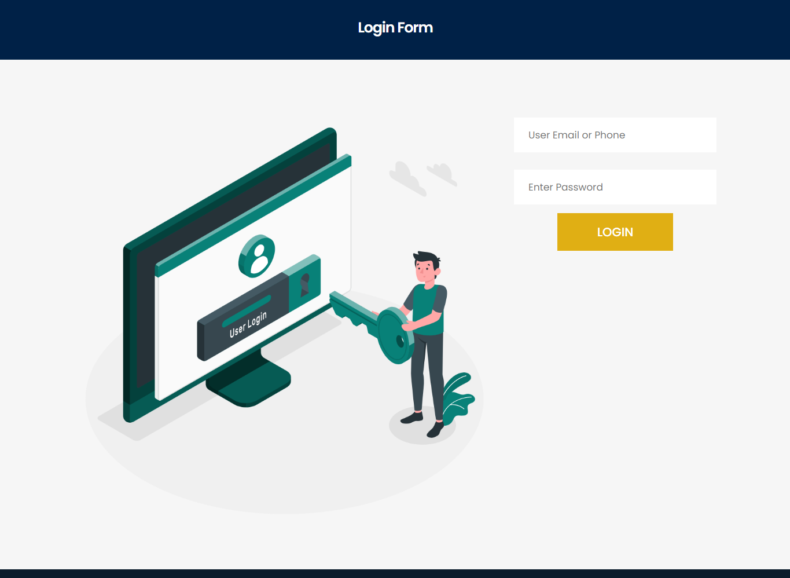
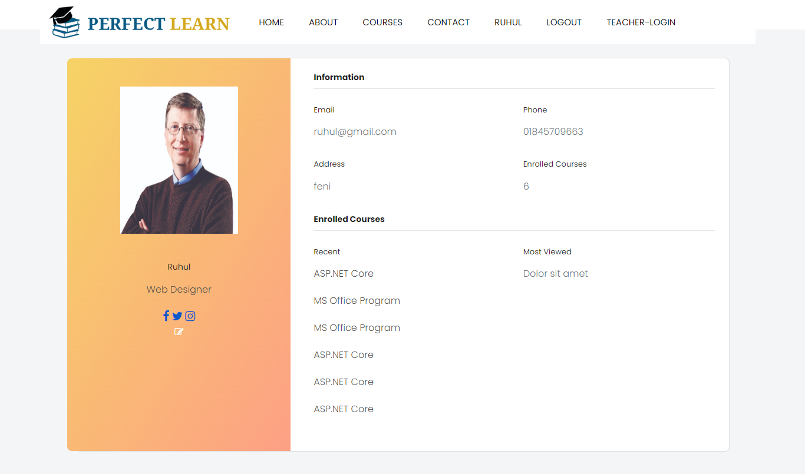
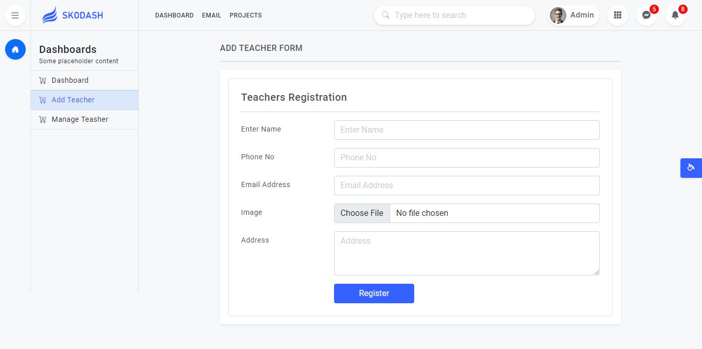
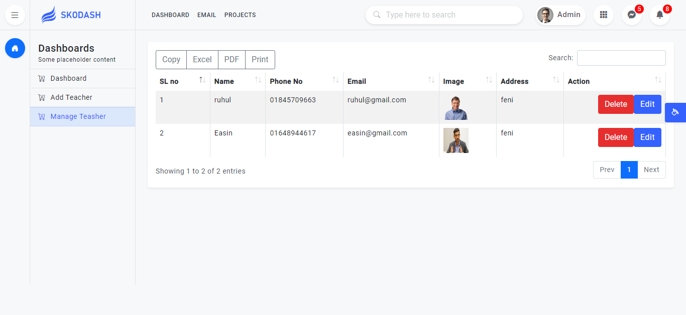
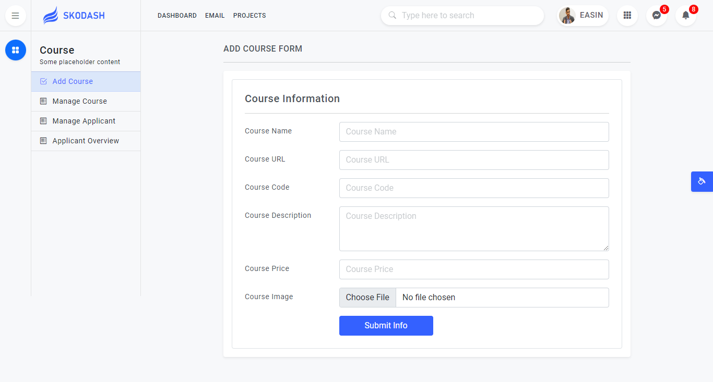
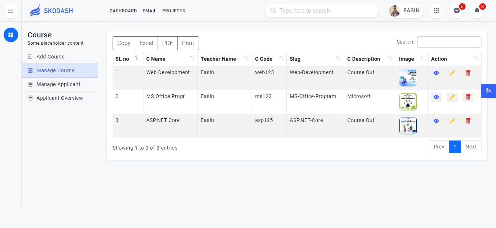

## School Management System
<blockquote>
This is a simple web-based open source software written in PHP, JavaScript. This was specifically written for school or online educational organization. You can easily install this system in your own server.
</blockquote>
<blockquote>
This systems provide functionality from applications and couse enrollment to detailed performance monitoring and financials. Administration management typically includes both faculty and students.
</blockquote>

## Features of School Management System
<ul>
    <li>Login System</li>
    <li>Manage Role</li>
    <li>Add Teacher</li>
    <li>Manage Teacher</li>
    <li>Manage Student</li>
    <li>Add Course</li>
    <li>Manage Course</li>
    <li>Student Admission</li>
    <li>Student Profile</li>
    <li>Teacher Profile</li>
</ul>

## Technology
<ul>
    <li>PHP</li>
    <li>Laravel</li>
    <li>MySQL</li>
    <li>JavaScript</li>
    <li>HTML</li>
    <li>CSS</li>
    <li>Bootstrap</li>
</ul>

## ScreenShot of this project
## Student Register Page
<table>
    <thead>
        <tr>
            <th>
                
            </th>
        </tr>
    </thead>
</table>

## Student Login Page
<table>
    <thead>
        <tr>
            <th>
                
            </th>
        </tr>
    </thead>
</table>

## Student Profile Page
<table>
    <thead>
        <tr>
            <th>
                
            </th>
        </tr>
    </thead>
</table>

## Courses Page
<table>
    <thead>
        <tr>
            <th>
                
            </th>
        </tr>
    </thead>
</table>

## Admin Login Page
<table>
    <thead>
        <tr>
            <th>
                
            </th>
        </tr>
    </thead>
</table>

## Admin Dashboard Pages
<table>
    <thead>
        <tr>
            <th>
                
            </th>
            <th>
                
            </th>
        </tr>
    </thead>
</table>

## Teacher Dashboard Pages
<table>
    <thead>
        <tr>
           <th>
                
            </th>
            <th>
                
            </th>
        </tr>
    </thead>
</table>

## Home Page
<table>
    <thead>
        <tr>
            <th>
                
            </th>
        </tr>
    </thead>
</table>